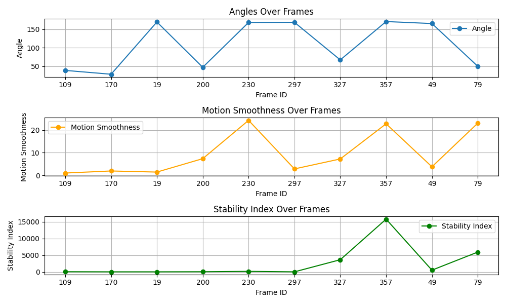

## Methodology

The presented experiment employs computer vision techniques to analyze the motion dynamics during stretch movements, ranging from upward to downward stretching actions. The workflow involves:

1. **Data Collection:**
   - Input video sequences are processed using a pose estimation model to extract key joint coordinates for each frame.
   - Metrics such as joint angles, motion smoothness, and movement stability index are calculated for every frame.

2. **Metric Definitions:**
   - **Angle:** Calculated based on selected joint connections (e.g., shoulder-elbow-wrist).
   - **Motion Smoothness:** Quantified by analyzing the jerk or rate of change in joint velocity.
   - **Movement Stability Index (MSI):** Evaluates consistency in joint trajectories and body center-of-mass across frames.

3. **Trigger Conditions:**
   - Frames are saved for analysis if thresholds for motion smoothness or MSI are exceeded.

4. **Visualization:**
   - Metrics are plotted against frame IDs to illustrate variations in joint angles, smoothness, and stability during the stretching sequence.

## Results

The analysis of the stretching motion revealed the following observations:

- **Angle Variations:**
  - Joint angles exhibited periodic changes, consistent with the expected stretch movement pattern. Peaks in the angle graph correspond to the upward stretching, while troughs indicate the downward movement.

- **Motion Smoothness:**
  - Smoothness fluctuated significantly during transitions, with the highest smoothness achieved at the peak and bottom of the stretch. This suggests more controlled movements at extremes.

- **Movement Stability Index:**
  - Stability varied based on the consistency of joint movements. Lower stability values occurred during rapid transitions, whereas more stable values were noted during slower, deliberate stretches.

The visual representation of the metrics over frame sequences (attached below) corroborates the above findings.

### Conclusion
This experiment demonstrates the efficacy of computer vision techniques in analyzing dynamic motion patterns. The results provide insights into motion stability and smoothness, which are critical for assessing exercise form and coordination.