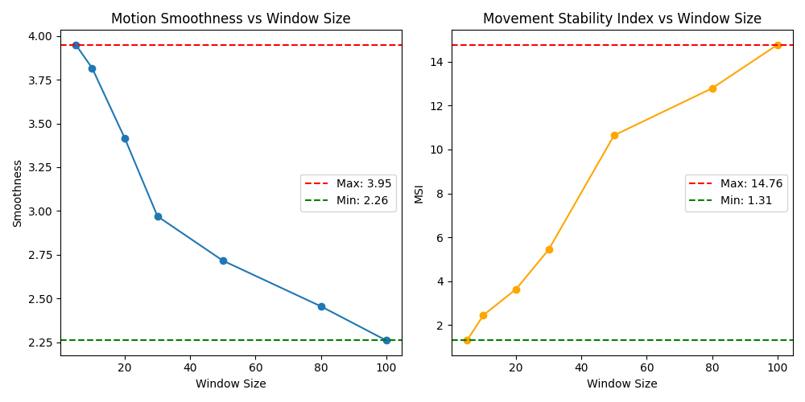

**Methodology**

To investigate the effects of varying temporal segments on biomechanical indicators, two primary measures were employed: Motion Smoothness and the Movement Stability Index (MSI). The Motion Smoothness metric is derived from the concept of jerk minimization, while the MSI integrates both joint trajectory variance and center-of-mass (COM) deviation to provide a holistic view of dynamic stability.

1. **Motion Smoothness Formula**:  
   Motion smoothness is quantified based on the third derivative of joint angles over time, commonly referred to as jerk. Given a sequence of joint angles $\theta_1, \theta_2, \ldots, \theta_N$, we first compute the discrete third-order differences (jerk) as:  
   $$
   J_i = \theta_{i+3} - 3\theta_{i+2} + 3\theta_{i+1} - \theta_i
   $$
   for $ i = 1, 2, \ldots, N-3 $. The mean absolute jerk is then taken as an index of smoothness:  
   $$
   \text{Motion Smoothness} = \frac{1}{N-3} \sum_{i=1}^{N-3} |J_i|
   $$
   Lower values indicate smoother movements, as they imply reduced high-frequency variations in angular acceleration.

2. **Movement Stability Index (MSI) Formula**:  
   The MSI accounts for both the dispersion of joint trajectories and the positional stability of the COM. Consider a set of joint trajectories sampled at times $ t_1, t_2, \ldots, t_N $, where each frame contains $ M $ joints, each represented by a 2D coordinate $(x_{j}, y_{j})$ for $ j = 1, 2, \ldots, M $. We define:
   - **Trajectory Variance**:  
     Compute the variance in both $x$ and $y$ directions across all joints, then take their mean:  
     $$
     \sigma_{\text{traj}}^2 = \frac{ \text{Var}(\{x_j\}) + \text{Var}(\{y_j\}) }{2}
     $$
   - **Center-of-Mass (COM) Deviation**:  
     Let $ \mathbf{c}_i = (c_{x,i}, c_{y,i}) $ be the COM at time $ t_i $, typically defined as the mean position of all joints at that frame:
     $$
     \mathbf{c}_i = \frac{1}{M}\sum_{j=1}^{M} (x_{j,i}, y_{j,i})
     $$
     The average COM deviation is calculated as the mean norm of the successive differences:
     $$
     d_{\text{COM}} = \frac{1}{N-1}\sum_{i=1}^{N-1} \|\mathbf{c}_{i+1} - \mathbf{c}_i\|
     $$

   The MSI is then given by:
   $$
   \text{MSI} = \sigma_{\text{traj}}^2 + d_{\text{COM}}
   $$

   Higher MSI values suggest greater instability, either due to a lack of spatial consistency in the joint trajectories or excessive COM movement.

**Windowing Procedure**:
To examine how these metrics vary with different temporal scales, the original angle and trajectory data were segmented using multiple window sizes. For each chosen window size, only the last $N$ frames (where $N$ is the window length) were extracted and analyzed, computing both metrics within that restricted temporal domain. By systematically varying $N$ (e.g., 5, 10, 20, 30, 50, 80, 100 frames), this approach revealed how short- vs. long-term movement behaviors influence the resultant smoothness and stability metrics.

**Results**

The results demonstrate that the choice of window size significantly impacts the observed values of Motion Smoothness and MSI. As the window size increased, the Motion Smoothness metric exhibited a general downward trend, suggesting that, over longer temporal segments, transient fluctuations in joint kinematics become more averaged, potentially diminishing the prominence of high-frequency variations. Conversely, the MSI values showed an increasing trend with larger window sizes, indicating that longer temporal segments may emphasize cumulative positional drift or accumulated variance in the trajectory, thus presenting an apparently less stable profile.

**Discussion**  

The results demonstrate that the choice of window size significantly impacts the observed values of Motion Smoothness and MSI. As the window size increased, the Motion Smoothness metric exhibited a general downward trend, suggesting that, over longer temporal segments, transient fluctuations in joint kinematics become more averaged, potentially diminishing the prominence of high-frequency variations. Conversely, the MSI values showed an increasing trend with larger window sizes, indicating that longer temporal segments may emphasize cumulative positional drift or accumulated variance in the trajectory, thus presenting an apparently less stable profile.

These contrasting responses highlight the complexity inherent in biomechanical data: short windows may be more sensitive to rapid changes or short-term perturbations in motion, while longer windows may capture broader, more global fluctuations. The interplay between local and global properties of the movement likely influences these metrics, emphasizing the need to carefully select or justify the window size depending on the research objectives and the nature of the motion under study.

**Conclusion**  

In summary, the findings underscore the importance of considering window size when analyzing time-dependent biomechanical indices. Varying the temporal scale can yield divergent interpretations of movement fluidity and stability. Researchers should therefore adopt a windowing strategy that aligns with their investigative goals, whether to capture fine-grained temporal transitions or to assess global movement trends. By doing so, more robust and contextually meaningful insights into human movement behavior and motor control can be achieved.