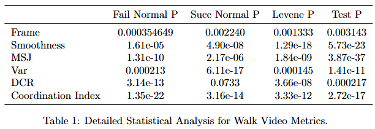

# Experiment 2: Coordination Assessment via Long Jump and Straight Walk

## Objective

The primary objective of this experiment is to develop and validate innovative metrics for assessing coordination and stability in standing long jump sequences and straight walking among young children. By analyzing data collected from movements classified as having good and poor coordination, this study aims to establish a robust framework for understanding motor skill development. The focus is on motion interpretability and practical applications in educational and developmental contexts, ensuring that the insights generated are directly actionable for physical educators and caregivers.

## Methodology

To achieve the study's objective, motion data were collected from children performing both long jumps and straight walking, categorized into movements with good and poor coordination. The YOLO framework was employed to extract skeletal data, enabling precise tracking of joint movements and overall body dynamics during these actions. This data formed the foundation for developing two innovative metrics designed to capture distinct aspects of motor performance.

### Metric 1: Limb Movement Trajectory Smoothness

This metric quantifies the fluidity of limb motions by analyzing the rate of change of acceleration (jerk) and variance in movement trajectories. The method involves the following mathematical framework:

1. **Data Extraction**: YOLO skeletal data provides 2D coordinates of body joints for each frame, focusing on specific limb segments such as forearms or calves. Each joint position at time $ t_i $ is represented as:
   $$
   \mathbf{p}(t_i) = (x_i, y_i, z_i)
   $$
   where $ x_i, y_i, z_i $ are the spatial coordinates.

2. **Time Intervals**: Calculate the time interval between frames using the frame rate $ f_{fps} $:
   $$
   \Delta t = \frac{1}{f_{fps}}
   $$

3. **Velocity Calculation**: Compute velocity as the rate of change of position over time:
   $$
   \mathbf{v}(t_i) = \frac{\mathbf{p}(t_{i+1}) - \mathbf{p}(t_i)}{\Delta t}
   $$

4. **Acceleration Calculation**: Compute acceleration as the rate of change of velocity:
   $$
   \mathbf{a}(t_i) = \frac{\mathbf{v}(t_{i+1}) - \mathbf{v}(t_i)}{\Delta t}
   $$

5. **Jerk Calculation**: Compute jerk as the rate of change of acceleration:
   $$
   \mathbf{j}(t_i) = \frac{\mathbf{a}(t_{i+1}) - \mathbf{a}(t_i)}{\Delta t}
   $$
   The magnitude of jerk is given by:
   $$
   \|\mathbf{j}(t_i)\| = \sqrt{j_x^2 + j_y^2 + j_z^2}
   $$

6. **Mean Squared Jerk (MSJ)**: Aggregate jerk magnitudes over all frames to compute MSJ:
   $$
   MSJ = \frac{1}{M}\sum_{i=1}^M \|\mathbf{j}(t_i)\|^2
   $$
   where $ M $ is the number of frames used for jerk calculation.

7. **Trajectory Variance**: Compute deviations from a smoothed trajectory:
   - Fit the original trajectory using cubic spline smoothing to obtain the smoothed path $ \mathbf{\hat{p}}(t_i) $.
   - Calculate deviations between the original and smoothed trajectories:
     $$
     e(t_i) = \|\mathbf{p}(t_i) - \mathbf{\hat{p}}(t_i)\|
     $$
   - Compute the variance of these deviations:
     $$
     Var = \frac{1}{N}\sum_{i=1}^N (e(t_i) - \bar{e})^2
     $$
     where $ \bar{e} $ is the mean deviation.

8. **Smoothness Index**: Integrate MSJ and trajectory variance into a composite smoothness index:
   $$
   Smoothness = \frac{1}{1 + MSJ \cdot Var}
   $$

### Metric 2: Joint Angle Dynamics (JAD)

This metric evaluates coordination and dynamic stability using joint angles derived from 2D skeletal data. By analyzing angle variations, angular velocities, and higher-order derivatives, JAD provides insights into biomechanical efficiency and motion adaptability.

1. **Joint Angle Calculation**: For a joint $ k $, the angle $ \theta_k(t) $ is calculated using the vectors formed by adjacent joints:
   $$
   \theta_k(t) = \arccos\left( \frac{(\mathbf{p}_{k-1}(t) - \mathbf{p}_k(t)) \cdot (\mathbf{p}_{k+1}(t) - \mathbf{p}_k(t))}{\|\mathbf{p}_{k-1}(t) - \mathbf{p}_k(t)\| \cdot \|\mathbf{p}_{k+1}(t) - \mathbf{p}_k(t)\|} \right)
   $$

2. **Angular Velocity and Acceleration**:
   - Angular velocity:
     $$
     \dot{\theta}_k(t_i) = \frac{\theta_k(t_{i+1}) - \theta_k(t_i)}{\Delta t}
     $$
   - Angular acceleration:
     $$
     \ddot{\theta}_k(t_i) = \frac{\dot{\theta}_k(t_{i+1}) - \dot{\theta}_k(t_i)}{\Delta t}
     $$

3. **Angular Jerk (Third-Order Derivative)**:
   $$
   j_{\theta_k}(t_i) = \frac{\ddot{\theta}_k(t_{i+1}) - \ddot{\theta}_k(t_i)}{\Delta t}
   $$

4. **Key Features**:
   - **Mean Squared Angular Jerk (MSAJ)**:
     $$
     MSAJ_k = \frac{1}{M}\sum_{i=1}^M (j_{\theta_k}(t_i))^2
     $$
   - **Variability**:
     $$
     Var(\theta_k) = \frac{1}{N}\sum_{i=1}^N (\theta_k(t_i) - \bar{\theta}_k)^2
     $$
   - **Coordination Index (CI)**: Using PCA, compute the number of principal components needed to explain 90% of the variance in joint angles. Define CI as:
     $$
     CI = \frac{1}{\#PCs_{90\%}}
     $$

5. **Frequency Analysis**:
   Apply FFT or wavelet transform to joint angle sequences. Extract:
   - High-frequency energy ratio:
     $$
     E_{highfreq}(\theta_k) = \frac{\sum_{f \in HF} P_{\theta_k}(f)}{\sum_f P_{\theta_k}(f)}
     $$
     where $ P_{\theta_k}(f) $ is the power at frequency $ f $.

6. **Comprehensive JAD Index**:
   Integrate MSAJ, variability, CI, and frequency features:
   $$
   JAD = \frac{1}{1 + \alpha \cdot MSAJ_k + \beta \cdot Var(\theta_k) + \gamma (1 - CI) + \delta \cdot E_{highfreq}(\theta_k)}
   $$

By combining these features, JAD captures the dynamic complexity and coordination efficiency of movements.

## Results

### Jump Video

The analysis of jump movements was conducted by comparing successful and failed attempts using statistical evaluations across multiple metrics, including Frame count, Smoothness, Mean Squared Jerk (MSJ), Variability (Var), and Dynamic Coordination Ratio (DCR). Key results are summarized below:

1. **Normality and Variance**:
   - Shapiro-Wilk tests indicated that most metrics violated normality assumptions for both successful and failed jumps.
   - Levene's test confirmed heterogeneity of variance for Frame count but homogeneity for other metrics.

2. **Statistical Tests**:
   - Non-parametric Mann-Whitney U tests were applied due to normality violations.
   - Frame count (p < 0.001) and Smoothness (p = 0.012) showed significant differences between successful and failed jumps.
   - MSJ approached significance (p = 0.067), indicating potential utility for further study.
   - Variability (Var) and DCR did not show significant differences (p > 0.05), suggesting limited discriminative power in this context.

3. **Insights from New Metrics**:
   - The Smoothness metric provided a novel way to quantify coordination, demonstrating significant sensitivity to success.
   - MSJ, while not statistically significant, hinted at its potential for capturing nuanced motor control differences, warranting additional validation.

Overall, the results support the utility of newly introduced metrics, particularly Smoothness, in distinguishing between successful and failed jump attempts. These findings highlight the potential for further refining these indicators to improve motion analysis precision and applicability in practical settings.

### Walk Video

The analysis of walking movements compared normal and abnormal walking patterns using statistical evaluations across the same metrics: Frame count, Smoothness, MSJ, Variability (Var), and DCR. Key findings include:

1. **Normality and Variance**:
   - Shapiro-Wilk tests indicated that most metrics violated normality assumptions for both normal and abnormal walks.
   - Levene's test showed heterogeneity of variance for most metrics, including Frame count and Smoothness.

2. **Statistical Tests**:
   - Non-parametric Mann-Whitney U tests demonstrated significant differences across all metrics except Frame count (p = 0.003).
   - Smoothness (p < 0.001), MSJ (p < 0.001), and Variability (p < 0.001) showed the strongest discriminative power between walking conditions.
   - DCR (p = 0.0002) also indicated significant differences, though its effect size was smaller compared to other metrics.

3. **Insights from New Metrics**:
   - Smoothness and MSJ consistently demonstrated their ability to capture subtle motor coordination differences, reinforcing their applicability across multiple movement contexts.
   - Variability provided additional interpretability, highlighting deviations in spatial consistency between normal and abnormal walking patterns.

The results underscore the robustness of the proposed metrics, particularly Smoothness and MSJ, in identifying deviations in walking patterns. These findings suggest their potential application in clinical gait analysis and rehabilitation monitoring.

## Conclusion

The innovative metrics introduced in this study—Limb Movement Trajectory Smoothness and Joint Angle Dynamics (JAD)—offer significant advancements in assessing motor coordination and stability. These metrics demonstrate a high sensitivity to subtle differences in movement quality, enabling precise differentiation between normal and abnormal patterns in both jump and walk sequences.

### Advantages of the Metrics

- **Smoothness and Coordination**: The Smoothness metric captures the fluidity of limb movements, providing a direct indicator of coordination. Its sensitivity to success in jump attempts and deviations in walking patterns underscores its utility across diverse motor tasks.
- **Dynamic Insights**: JAD extends the analysis by integrating angular velocity, acceleration, and higher-order derivatives, offering a comprehensive view of joint dynamics. This metric excels in identifying biomechanical inefficiencies and coordination challenges, with robust applications in clinical diagnostics and rehabilitation.
- **Generalizability**: Both metrics adapt seamlessly to various movement types, making them versatile tools for evaluating a wide range of motor activities.

### Future Applications

- **Clinical Diagnostics**: These metrics can be deployed to detect and monitor movement disorders, such as cerebral palsy, Parkinson’s disease, or post-stroke impairments. Their precision facilitates early intervention and personalized treatment planning.
- **Rehabilitation Monitoring**: By quantifying improvements in motor coordination and stability, the metrics support data-driven rehabilitation strategies, ensuring effective recovery pathways for patients.
- **Educational and Sports Training**: The metrics can assist educators and coaches in evaluating and enhancing motor skills in young learners and athletes, fostering optimal physical development.

### Enhancing Diagnostic Capabilities

The proposed metrics bridge the gap between raw movement data and actionable insights, transforming motion analysis into a powerful diagnostic tool. By quantifying movement quality and identifying specific coordination deficits, these metrics enable:

- **Objective Assessments**: Moving beyond subjective evaluations, the metrics provide quantifiable data for precise decision-making.
- **Tailored Interventions**: Clinicians can design targeted therapies based on detailed biomechanical profiles, ensuring interventions address individual needs.
- **Longitudinal Tracking**: The ability to track progress over time enhances the evaluation of treatment efficacy and patient outcomes.

In conclusion, the development and validation of Smoothness and JAD metrics mark a significant step forward in motion analysis. Their integration into clinical, educational, and sports contexts has the potential to revolutionize how we understand and optimize human movement.